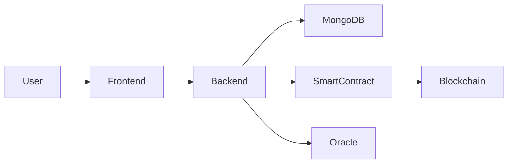
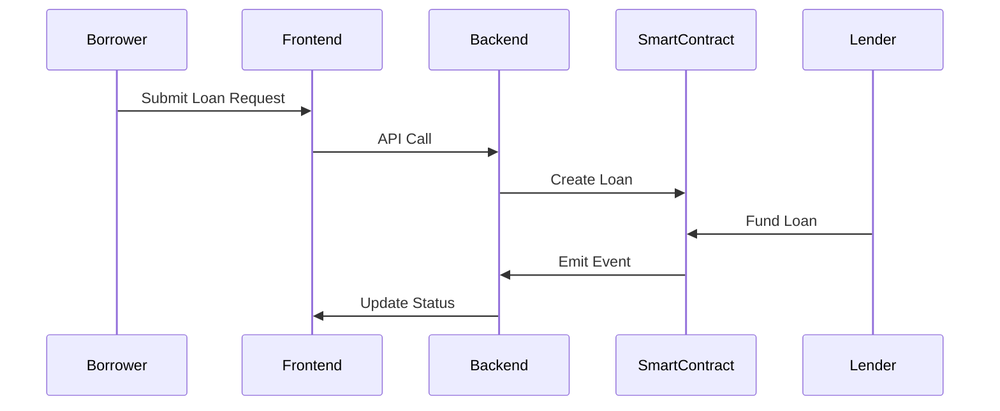
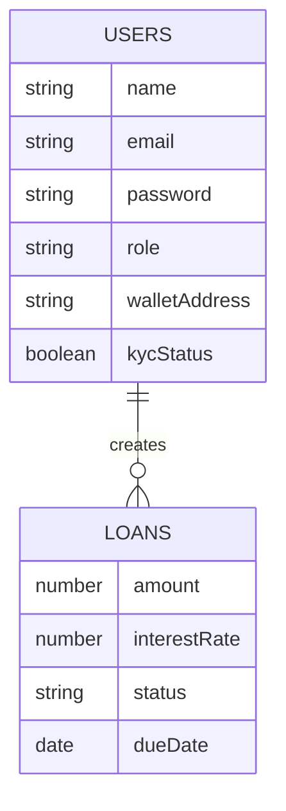
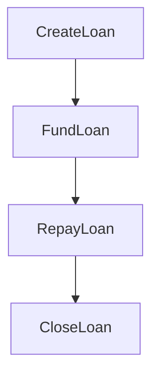

# 💰 Simplified Microloans Platform
### Blockchain-Enabled Microloan Infrastructure for Street Vendors

> A Full-Stack + Web3 Financial Platform  
> Built with Node.js, Express, MongoDB, React, Solidity & Hardhat  

---

# 📌 Executive Summary

Simplified Microloans is a decentralized micro-lending system that enables:

- Street vendors to request small loans securely
- Lenders to fund loans transparently
- Admins to verify and approve
- Blockchain to ensure trust & immutability

This project combines traditional backend architecture with smart contracts to create a secure and scalable financial ecosystem.

---

# 🏗 High-Level Architecture (HLD)



---

# 🧠 Low-Level Design (LLD)

### Core Modules

| Module | Responsibility |
|--------|---------------|
| Auth Module | User registration & login |
| Loan Module | Loan creation & management |
| Smart Contract Service | Blockchain interaction |
| KYC Module | Encryption & identity validation |
| Admin Module | Approval & monitoring |

---

# 🧩 Technology Stack

| Layer | Technology |
|-------|------------|
| Frontend | React.js |
| Backend | Node.js + Express |
| Database | MongoDB |
| Blockchain | Solidity |
| Framework | Hardhat |
| Authentication | JWT |
| Password Security | bcrypt |
| Encryption | AES |
| Testing | Mocha / Chai |

---

# 👥 User Roles

| Role | Permissions |
|------|------------|
| Borrower | Apply, repay loans |
| Lender | Fund loans |
| Admin | Approve / reject |
| Oracle | External verification |

---

# 🔄 Loan Lifecycle Workflow



---

# 🗄 ER Diagram



---

# 🗃 Database Schema

## Users Collection

| Field | Type | Description |
|-------|------|------------|
| _id | ObjectId | Unique ID |
| name | String | Full Name |
| email | String | Email |
| password | String | Hashed Password |
| role | String | borrower/lender/admin |
| walletAddress | String | Blockchain Address |
| kycStatus | Boolean | Verification Status |

## Loans Collection

| Field | Type | Description |
|-------|------|------------|
| _id | ObjectId | Loan ID |
| borrowerId | ObjectId | Reference to User |
| amount | Number | Loan Amount |
| interestRate | Number | Interest % |
| status | String | Pending/Funded/Repaid |
| dueDate | Date | Repayment Date |

---

# 🔐 Smart Contract Design

```solidity
struct Loan {
    address borrower;
    uint256 amount;
    uint256 interest;
    bool funded;
    bool repaid;
}
```

---

# 🔗 Smart Contract Flow



---

# 🌐 API Endpoints

## Authentication APIs

| Method | Endpoint | Description |
|--------|----------|------------|
| POST | /api/auth/register | Register user |
| POST | /api/auth/login | Login user |

## Loan APIs

| Method | Endpoint | Description |
|--------|----------|------------|
| POST | /api/loans | Create loan |
| GET | /api/loans | Get all loans |
| GET | /api/loans/:id | Get single loan |
| PUT | /api/loans/:id | Update loan |

---

# 🔒 Security Architecture

| Layer | Implementation |
|-------|---------------|
| Password Hashing | bcrypt |
| JWT Authentication | Access Tokens |
| Role-Based Access | Middleware |
| Data Encryption | AES |
| Smart Contract Validation | Hardhat Testing |
| Ledger Security | Blockchain Immutability |

---

# 📊 Risk Mitigation

| Risk | Mitigation Strategy |
|------|-------------------|
| Loan Default | Escrow model |
| Fraud | KYC Verification |
| Double Funding | Smart Contract Validation |
| Data Tampering | Immutable Blockchain |

---

# 🧪 Testing Strategy

| Layer | Tool |
|-------|------|
| Backend | Mocha |
| Smart Contract | Hardhat |
| API Testing | Postman |
| Frontend | React Testing Library |

---

# 🚀 Deployment Guide

## Install Dependencies

```bash
npm install
```

## Run Backend

```bash
cd backend
npm run dev
```

## Run Frontend

```bash
cd dhan-setu-frontend
npm start
```

## Deploy Smart Contracts

```bash
npx hardhat compile
npx hardhat run scripts/deploy.js --network localhost
```

---

# 📈 Scalability Design

- Stateless JWT Authentication
- Horizontal Scaling Ready
- Microservices Compatible
- Load Balancer Friendly

---

# 💼 Investor Pitch

### Problem
Millions of street vendors lack access to formal financial systems.

### Solution
A blockchain-secured microloan platform ensuring transparency & trust.

### Revenue Model
- Platform Service Fee
- Interest Margin
- Premium Analytics

### Market Potential
Large unbanked population in emerging markets.

---

# 🔮 Future Roadmap

- AI Credit Scoring Engine
- Mobile Application
- UPI Integration
- NFT Loan Certificates
- Multi-Chain Support

---

# 👨‍💻 Author

Sivamani Ganjerupalli  
B.Tech – IoT & Cybersecurity (Blockchain)

---

# 📜 License

MIT License

---

# ⭐ Support

If you like this project, give it a star ⭐ on GitHub.
